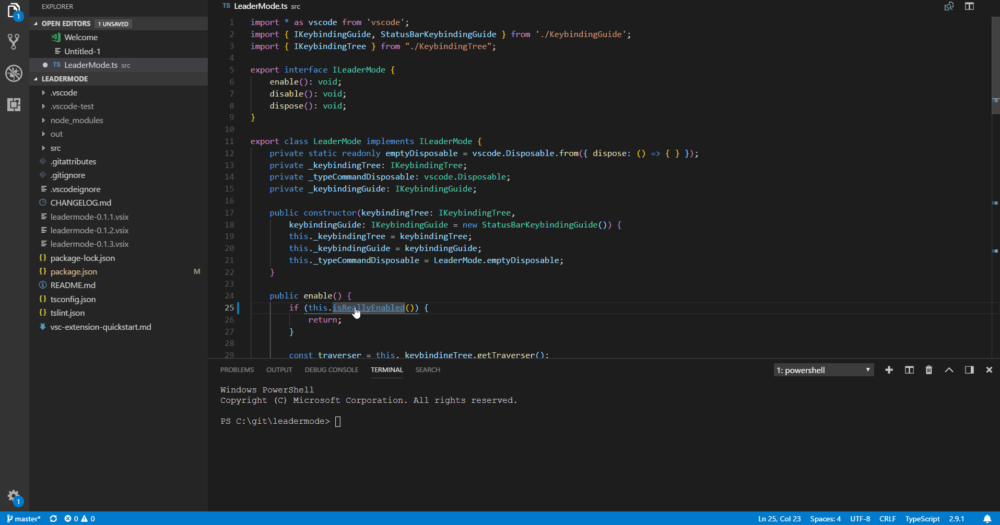

<h2 align="center"><br>LeaderMode</h2>
<p align="center"><strong>A standalone leader-key mode for Visual Studio Code</strong></p>

[](https://marketplace.visualstudio.com/items?itemName=michaelgriscom.leadermode)
[](https://travis-ci.com/michaelgriscom/LeaderMode)


LeaderMode provides a mechanism for unifying VSCode keybindings into a single entry point,
similar to the leader key mechanism in Vim, combined with a visual interface similar to
[which-key](https://github.com/justbur/emacs-which-key). This allows for more mnemonic
and discoverable shortcuts without requiring a modal editing environment. The
behavior, along with some keybindings, were inspired by the [Spacemacs](http://spacemacs.org)
distribution.



## Features
LeaderMode allows for the use of a tree of keybindings instead of (or in addition to) normal shortcuts, such as `Ctrl+Shift+J`.
This allows for more mnemonic and semantic keybindings, for example `e-r` to create a new editor to the right, `e-l`
to create an editor to the left.

Upon pressing the leader key, a key guide is displayed in the status bar of the
VSCode window as an interactive cheat-sheet of the tree of keybindings.


 LeaderMode can be exited through the `Escape` key, or by pressing a non-special character not present in the current tree layer (e.g., typing `z` in the example below). When combined with a utility like [sharpkeys](https://github.com/randyrants/sharpkeys) you can change the apps/menu key of your keyboard to invoke a normally unused key (such as F14), then in VSCode map that key to `leadermode.enter` in order to more efficiently enter commands.

## Extension Settings

### Commands
Customizable via keybindings.json:
* `leadermode.enter`: Enters leader mode. Default: `Ctrl+L`
* `leadermode.exit`: Exits leader mode. Default: `Escape`

### Configuration
Customizable via settings.json:
* `leadermode.showKeyGuide`: Value indicating whether to show the key guide. Allowable values are `always` and `never`. Default: `always`
* `leadermode.keybindings`: An array of case-sensitive keybindings (or key sequence labels) of the form
```
{
    "keySequence": string[],
    "label": string, // optional. If not present, 'command' is used
    "command": string, // optional. If not present, entry is treated as just a label
    "args": any[] // optional. Arguments to provide to the command upon execution
}
```

### Context
* `leadermode.isActive` indicates whether the mode is currently active.

## Known Issues and Limitations

* Due to a limitation that keypress messages are only forwarded if there's an active editor group,
currently leader mode is only activated if there's an active editor. One potential workaround
is to trigger the command `workbench.action.focusActiveEditorGroup` prior to invoking leader mode, however this can result in non-obvious behavior.
* Special characters (such as tab) are not currently supported as part of a key sequence
* LeaderMode should not be used in combination with Vim extensions due to a [VSCode limitation](https://github.com/Microsoft/vscode/issues/13441).